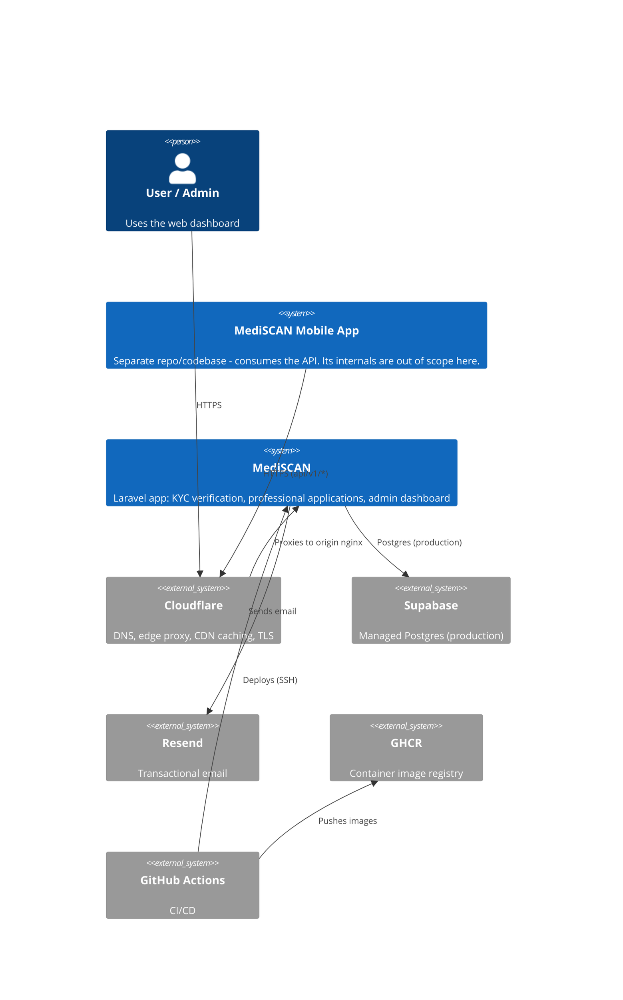
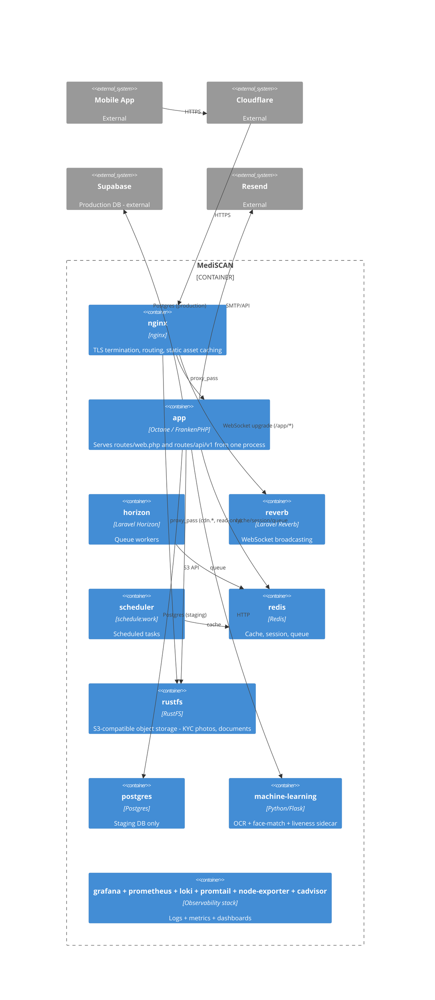
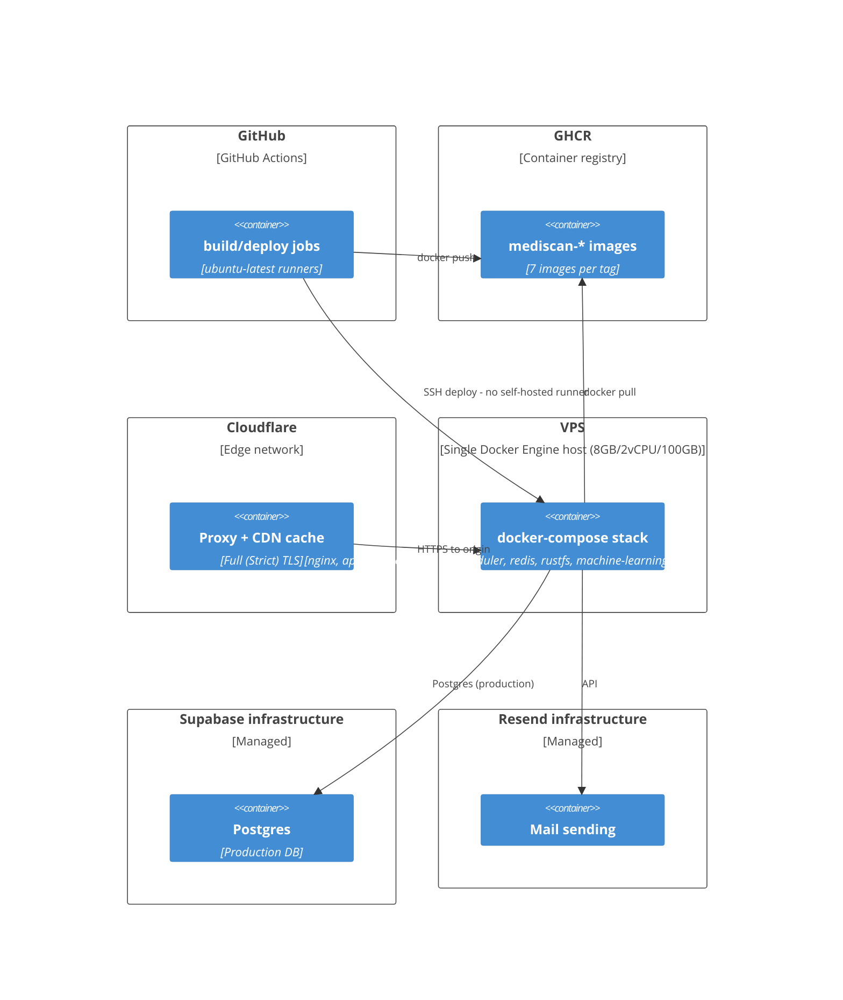

# System architecture

This is not covered by Scribe — Scribe only documents HTTP routes under `api/v1/*` (`config/scribe.php`), and has nothing to say about deployment topology, infrastructure, or how services relate to each other. This document is the source of truth for that. Scribe's own docs (the HTTP API reference) live at `/docs` on the app itself, staging only (`app/Http/Middleware/RestrictScribeDocsAccess.php` 404s it elsewhere).

For the one-time external account setup (Supabase, Resend, Cloudflare, SSH keys) referenced by these diagrams, see [`DEPLOYMENT_SETUP.md`](DEPLOYMENT_SETUP.md). For day-to-day operational commands, see [`infrastructure/README.md`](../infrastructure/README.md).

## Context

Who and what talks to MediSCAN, and what it talks to.

## Container

Internals of the MediSCAN system itself — everything else (mobile app, Supabase, Resend, Cloudflare) is external and undecomposed here, same treatment as the Context diagram.

## Deployment

Physical/infrastructure placement — where things actually run.

## Notes on these diagrams

- Rendered via Mermaid's C4 diagram types, which GitHub renders natively in markdown. If a given Mermaid version doesn't render these acceptably, the fallback is a plain flowchart styled by C4 level (Context/Container/Deployment) — same content, different syntax.
- The mobile app and every external service (Supabase, Resend, Cloudflare, GHCR) are deliberately left undecomposed — their internals are out of scope for this document, same as the C4 method intends.
